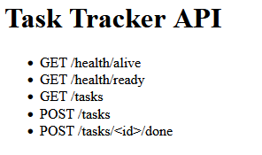

## Запуск проєкту через Docker Compose (Лабораторна №2)

Для автоматичного розгортання всіх сервісів (Nginx, WebApp, PostgreSQL) в ізольованому середовищі виконайте наступні кроки:

1. Переконайтеся, що у вас встановлено Docker та Docker Compose.
2. Клонуйте репозиторій та перейдіть у папку проєкту:
   `git clone -b lab2 https://github.com/markOone/devops.git`
   `cd devops`
3. Запустіть систему однією командою:
   `docker compose up -d --build`

Застосунок буде доступний за адресою: http://localhost
Дані бази збережуться на диску і не зникнуть після перезапуску контейнерів.
Щоб зупинити роботу, виконайте: `docker compose down`

